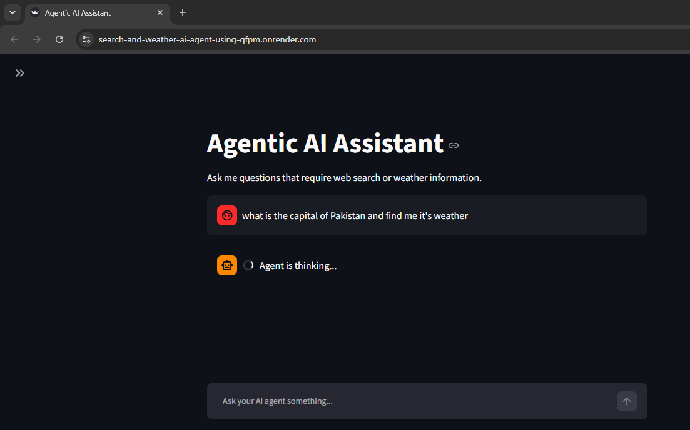
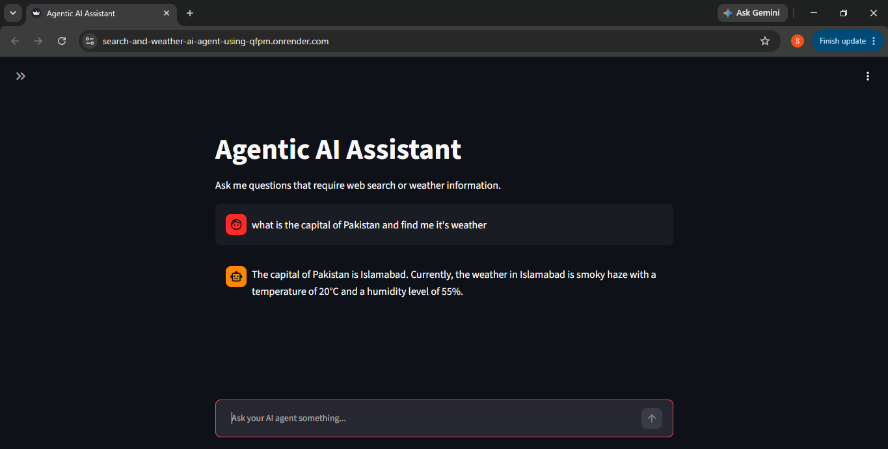

# Search-and-Weather AI Agent

An AI-powered conversational agent built with LangChain that can understand user queries, determine which tool is needed, and use external tools to provide useful answers.

The agent can handle general questions, perform web searches, and retrieve current weather information for different locations.

---

## Live Demo



---

## Features

* Conversational AI — Ask questions naturally through a chat interface.
* Agentic Tool Selection — The agent determines when an external tool is needed.
* Web Search — Searches the web for information that may require up-to-date knowledge.
* Weather Information — Retrieves weather information for requested locations.
* Multi-step Reasoning — Can combine tool usage with LLM reasoning to formulate responses.
* Streamlit Interface — Interactive web-based interface.
* Cloud Deployment — Deployed and accessible through Render.

---

## Architecture

The application follows a simple agent-based workflow:

```text
                    ┌─────────────────┐
                    │      User       │
                    │     Query       │
                    └────────┬────────┘
                             │
                             ▼
                    ┌─────────────────┐
                    │   LangChain     │
                    │      Agent      │
                    └────────┬────────┘
                             │
                    ┌────────┴────────┐
                    │  Decide whether │
                    │   a tool is     │
                    │     needed      │
                    └────────┬────────┘
                             │
              ┌──────────────┼──────────────┐
              ▼              ▼              ▼
        ┌──────────┐   ┌───────────┐  ┌───────────┐
        │   LLM    │   │ Web Search│  │  Weather  │
        │ Response │   │   Tool    │  │   Tool    │
        └──────────┘   └───────────┘  └───────────┘
              │              │              │
              └──────────────┼──────────────┘
                             ▼
                    ┌─────────────────┐
                    │  Final Answer   │
                    └─────────────────┘
```

The LLM acts as the reasoning layer while external tools provide information that the model cannot reliably provide from its own knowledge.

---

## Tech Stack

| Technology       | Purpose                      |
| ---------------- | ---------------------------- |
| Python           | Core programming language    |
| LangChain        | Agent and tool orchestration |
| Google Gemini    | Large Language Model         |
| Tavily           | Web search                   |
| Streamlit        | Web application interface    |
| Weather API/Tool | Weather data retrieval       |
| Render           | Cloud deployment             |

---

## Project Structure

```text
Search-and-Weather-AI-Agent/
│
├── app.py       # Streamlit application
├── main.py           
├── requirements.txt        # Python dependencies          
├── .gitignore
└── README.md
```

---

## How It Works

### 1. User submits a query

The user enters a question through the Streamlit chat interface.

For example:

```text
What's the weather in Islamabad?
```

### 2. The agent analyzes the query

LangChain passes the request to the Gemini-powered agent.

The agent determines whether the question can be answered directly or whether an external tool is required.

### 3. The appropriate tool is selected

For example:

```text
What's the weather in Islamabad?
        ↓
Weather Tool
        ↓
Weather Data
        ↓
Gemini
        ↓
Final Response
```

For an up-to-date information request:

```text
What are the latest AI developments?
        ↓
Web Search Tool
        ↓
Search Results
        ↓
Gemini
        ↓
Final Response
```

### 4. The agent generates the final response

The retrieved information is provided back to the LLM, which uses it to formulate a natural-language response for the user.

---

## Running Locally

### 1. Clone the repository

```bash
git clone <your-repository-url>
cd Search-and-Weather-AI-Agent
```

### 2. Create a virtual environment

Using Conda:

```bash
conda create -n langagent-clean python=3.11
conda activate langagent-clean
```

Or using Python's built-in virtual environment:

```bash
python -m venv venv
```

Activate it on Windows:

```bash
venv\Scripts\activate
```

### 3. Install dependencies

```bash
pip install -r requirements.txt
```

### 4. Configure API keys

Create a `.env` file in the project root:

```env
GOOGLE_API_KEY=your_google_api_key
TAVILY_API_KEY=your_tavily_api_key
```

### 5. Run the application

```bash
streamlit run app.py
```

The application will be available at:

```text
http://localhost:8501
```

---

## Deployment

The application is deployed on Render as a Python Web Service.

The deployment uses:

```text
Python 3.11.11
```

The application is started using:

```bash
streamlit run app.py --server.port $PORT --server.address 0.0.0.0
```

API keys are configured through Render's environment variables rather than being stored in the repository.

---

## Environment Variables

The application requires the following environment variables:

| Variable         | Description                   |
| ---------------- | ----------------------------- |
| `GOOGLE_API_KEY` | API key for Google Gemini     |
| `TAVILY_API_KEY` | API key for Tavily web search |

These variables should be configured both locally and in the deployment environment.

---

## Example Queries

### General Questions

```text
Explain machine learning in simple terms.
```

```text
What is the difference between AI and machine learning?
```

### Weather

```text
What's the weather in Islamabad?
```

```text
What's the temperature in Lahore?
```

### Web Search

```text
What are the latest developments in generative AI?
```

```text
Search for recent information about LangChain.
```

The agent determines whether an external tool is required based on the user's request.

---

## Project Goals

This project was built to explore how LLM-powered agents can interact with external tools rather than relying solely on the model's internal knowledge.

The main concepts demonstrated include:

* LLM-based reasoning
* Agentic workflows
* Tool calling
* Web search integration
* Real-time information retrieval
* API integration
* Conversational interfaces
* Cloud deployment

---

## Future Improvements

* [ ] Add conversation memory
* [ ] Improve error handling for unavailable APIs
* [ ] Add source citations for web-search responses
* [ ] Add more external tools
* [ ] Add structured agent evaluation
* [ ] Add automated testing
* [ ] Add response latency monitoring
* [ ] Add logging and observability
* [ ] Improve UI/UX
* [ ] Add authentication for production use

---

## Author

**Sheeza Tanveer**


---

## License

This project is available for educational and portfolio purposes.
